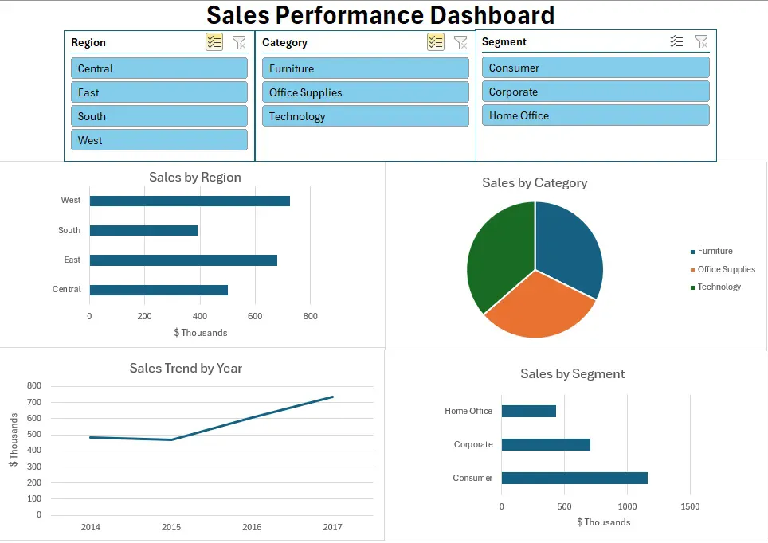

# Sales Performance Dashboard

Excel dashboard analyzing retail sales performance across product categories, regions, and customer segments.

## Overview
Interactive dashboard built to explore sales trends and identify top-performing regions, categories, and customer segments.

## Features
- Power Query for data import and cleaning
- Pivot tables for sales breakdowns by region, category, segment, and year
- Interactive slicers to filter all charts simultaneously
- Clean dashboard layout with no exposed raw data

## Tools Used
- Microsoft Excel
- Power Query
- Pivot Tables & Pivot Charts

## Data
Sample retail sales data (Superstore dataset from Kaggle)

## Screenshot

## CSV attached separately

